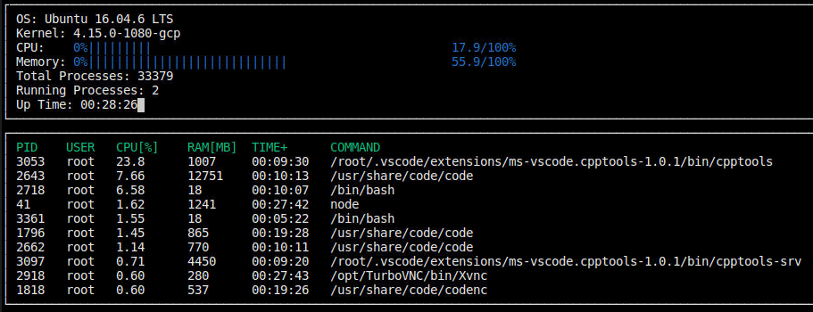

# CppND-System-Monitor

This is the implementation for the second project of the [Udacity C++ Nanodegree Program](https://www.udacity.com/course/c-plus-plus-nanodegree--nd213).

Main subject: implement a system monitor similar to [htop](https://htop.dev/).

Additional tasks:
- [x] Added the googletest library
- [x] Implemented unit tests for the parsers and helpers
- [ ] Add several command line parameters (f.e. refresh interval, sorting of the processes etc.)
- [ ] Enhance unit testing by using mock input streams instead of real files (located under test/resources)

## Make
This project uses [Make](https://www.gnu.org/software/make/). The Makefile has four targets:
* `build` compiles the source code and generates an executable
* `format` applies [ClangFormat](https://clang.llvm.org/docs/ClangFormat.html) to style the source code
* `debug` compiles the source code and generates an executable, including debugging symbols
* `clean` deletes the `build/` directory, including all of the build artifacts

## Instructions for trying out

1. Clone the project repository: `git clone https://github.com/TimG1997/System-Monitor-CPP-Udacity.git`

2. Build the project: `make build`

3. Run the resulting executable: `./build/monitor`
